# hello_world

**Nama: Meriam Oktavia Martadinata**
**Nim: 244107060018**
**Kelas: SIB-2G**

**praktikum 1: menjalankan aplikasi flutter baru**

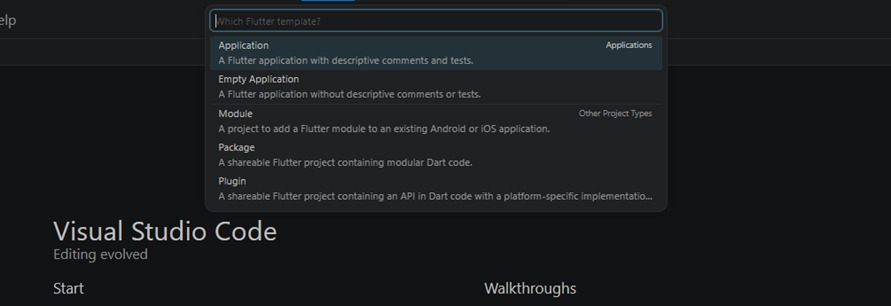
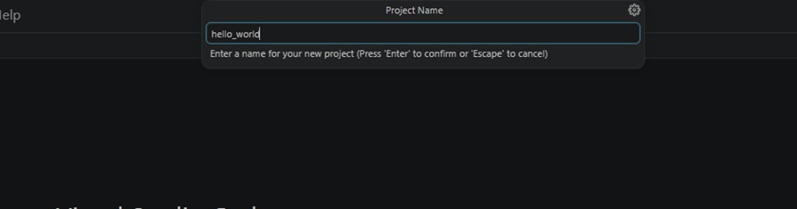
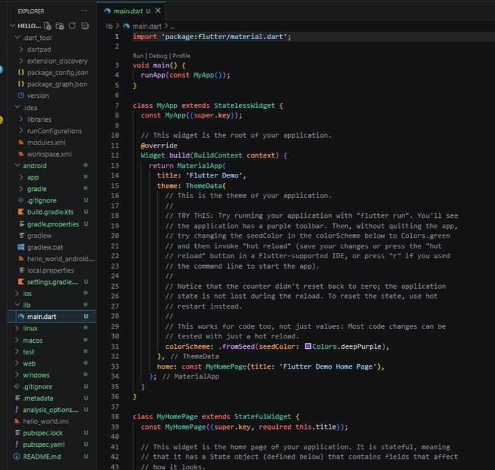

**praktikum 2: Menjalankan aplikasi hello world pada perangkat fisik (device Android/iOS)**

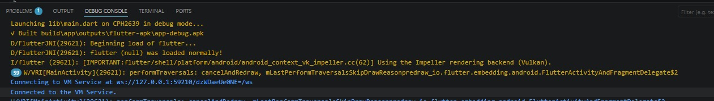
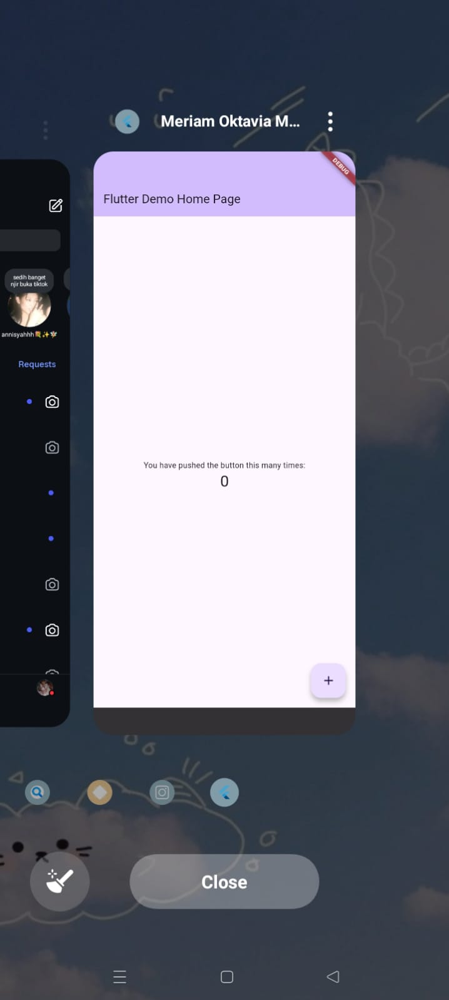

**praktikum 3: repository github dan laporan**
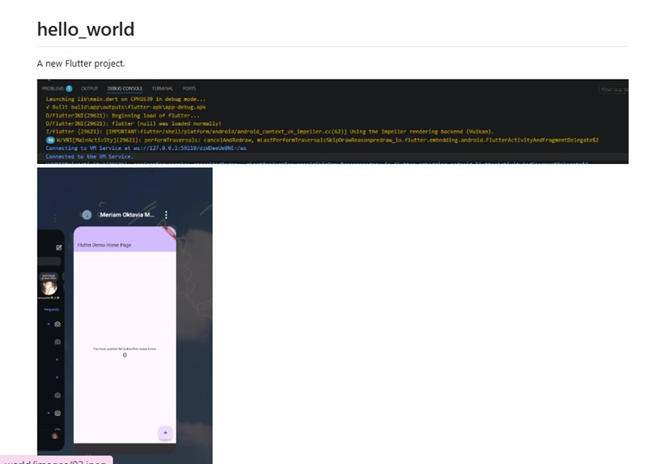

sudah berhasil melakukan laporan di file readme.md

**praktikum 4: Menerapkan widget dasar**
Langkah 1: Text Widget
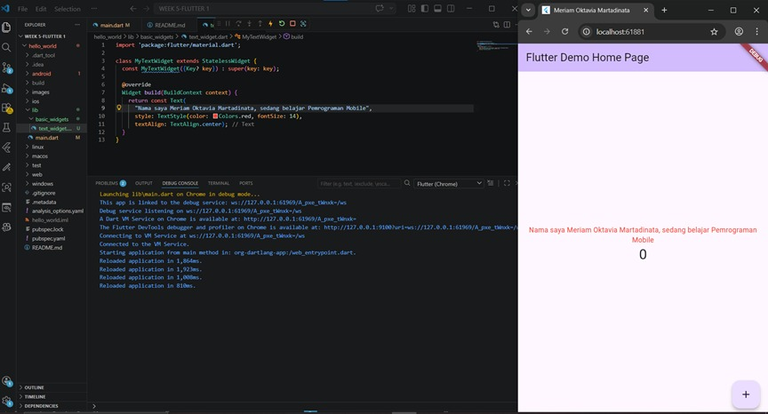
berhasil mengubah text sesuai nama masing masing

Langkah 2: Image widget
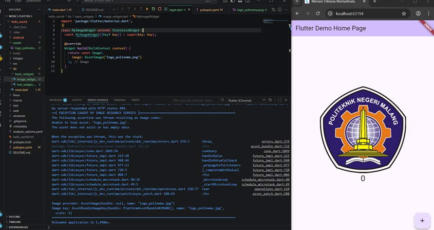
logo polinema berhasil tampil

**praktikum 5: Menerapkan widget material design dan OS cupertino**
Langkah 1: Cupertino button dan loading bar
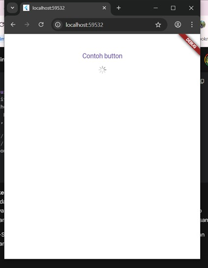

Langkah 2: Floating action button (FAB)
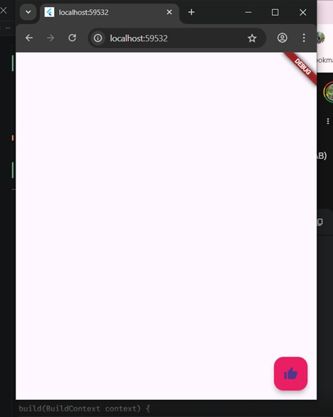

Langkah 3: Scaffold widget
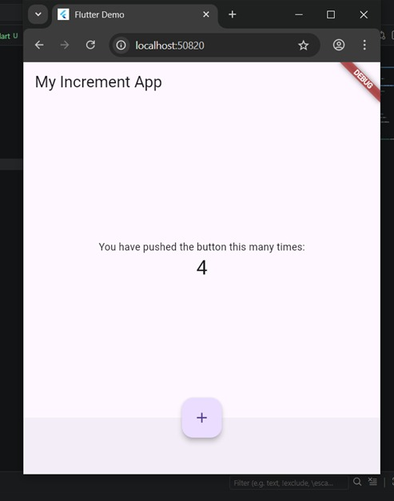

Langkah 4: Dialog Widget
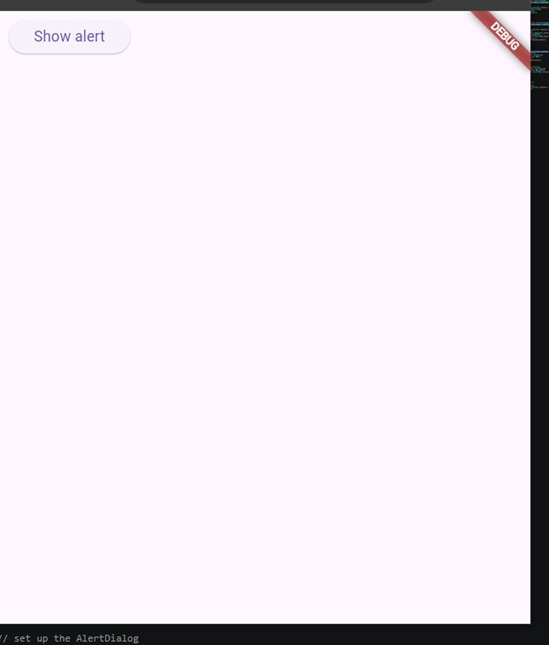
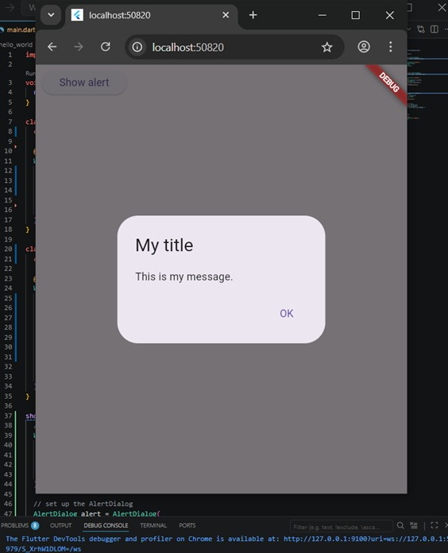

Langkah 5: Input dan Selection widget
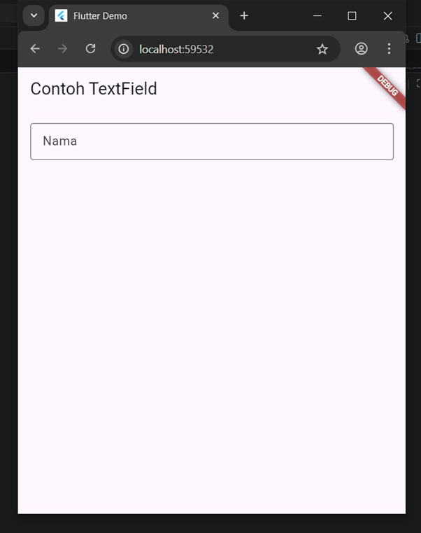

Langkah 6: Date dan time pickers
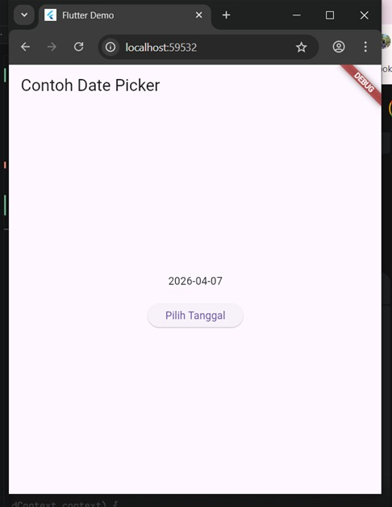
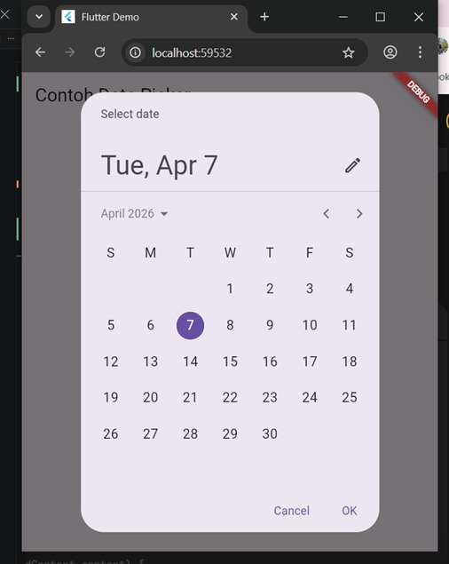

