# Mery App

* **Nama:** Meriam Oktavia Martadinata
* **NIM:** 244107060018
* **Kelas:** SIB-2G

---

## Create a Project
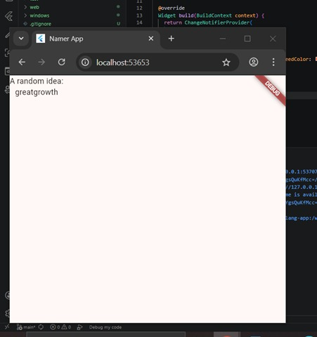

---

## Add a Button
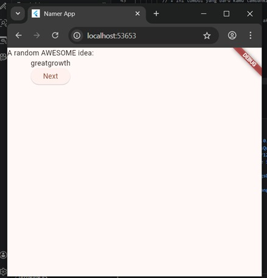

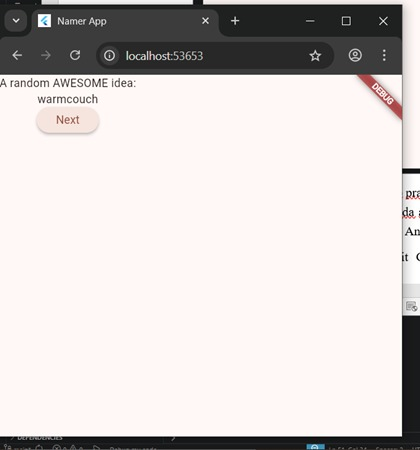

*Ada perubahan teks setiap kali tombol ‘next’ diklik.*

---

## Make the App Prettier
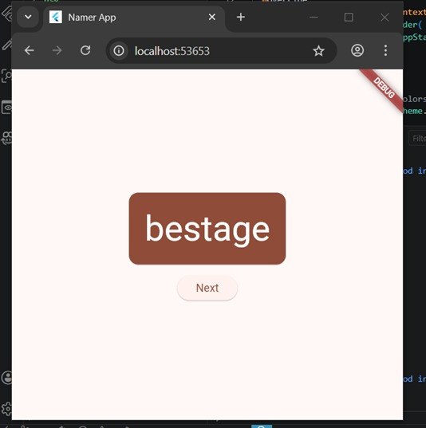

*Kartu berwarna oranye dengan tulisan putih besar di tengah layar. Kata di dalam kartu berubah setiap kali diklik.*

---

## Add Functionality
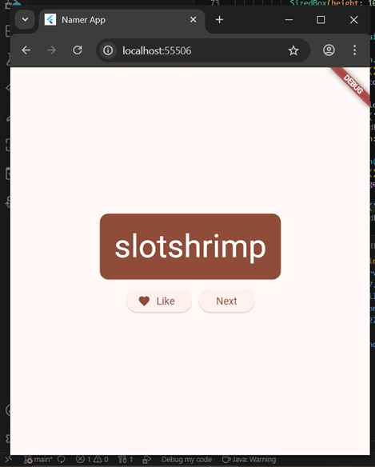

* **Logika Tombol:** Tombol Next berfungsi mengganti kata, dan tombol Like bisa menyimpan kata ke daftar favorit.
* **State Management:** Aplikasinya sekarang punya "ingatan". Ia tahu kata apa saja yang disukai dan mana yang baru muncul.
* **UI Dinamis:** Ikon hati otomatis berubah (dari garis jadi isi) begitu kamu klik Like.
* **Layout Row:** Memakai widget `Row` agar kedua tombol sejajar.

---

## Add Navigation Rail
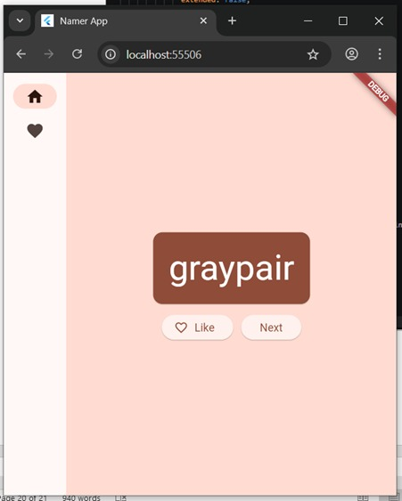

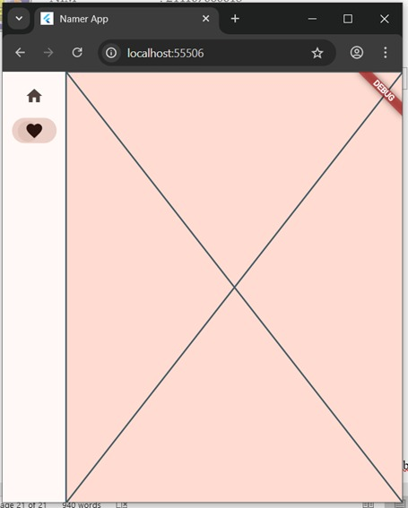

*Aplikasinya sekarang bisa berpindah antara GeneratorPage dan halaman sementara yang akan segera menjadi halaman favorit.*

---

## Responsiveness
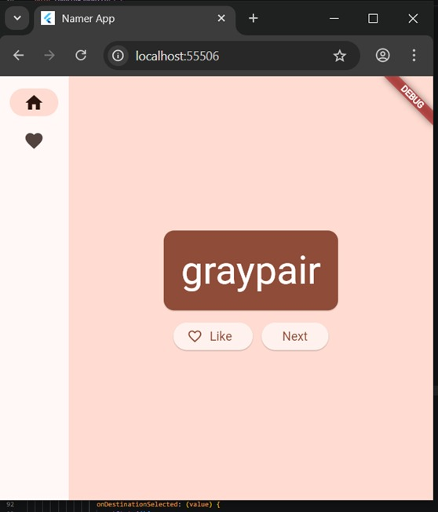

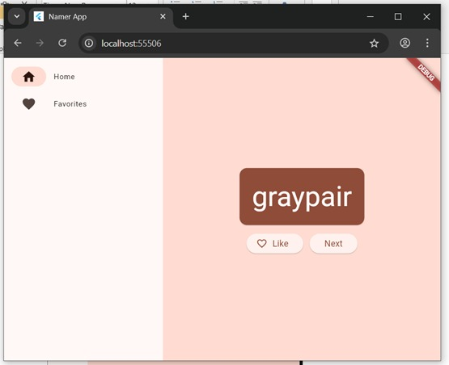

*Tampilan aplikasi sekarang tidak kaku dan bisa otomatis menyesuaikan diri tergantung di mana ia dijalankan, baik itu di layar HP yang kecil, tablet yang sedang, atau monitor laptop yang lebar.*

---

## Add a New Page
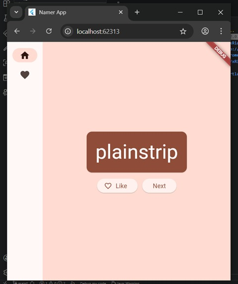

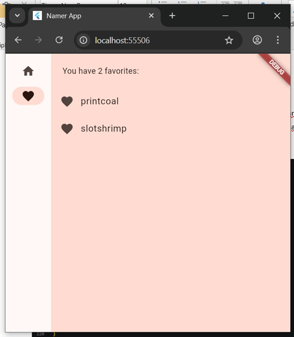

*Halaman FavoritesPage berfungsi sebagai penampung semua kata yang sudah diberi tanda "Like" sebelumnya. Secara teknis, aplikasi menggunakan logika Conditional Rendering, di mana ia akan mengecek terlebih dahulu apakah daftar favorit kosong. Jika kosong, maka hanya akan muncul teks "No favorites yet" di tengah layar.*

*Namun, jika sudah ada isinya, aplikasi akan menampilkan daftar tersebut menggunakan widget `ListView` yang memungkinkan pengguna untuk melakukan scrolling jika daftar katanya sudah sangat banyak. Setiap item di dalamnya dibungkus oleh `ListTile`, yang secara otomatis merapikan tampilan dengan memberikan ikon hati di sisi kiri dan teks kata acak di sampingnya. Penggunaan variabel `appState.favorites.length` juga membuat aplikasi ini interaktif, karena jumlah favorit yang tertera di bagian atas akan otomatis bertambah atau berkurang secara real-time.*