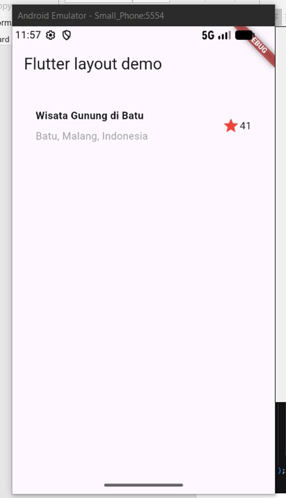
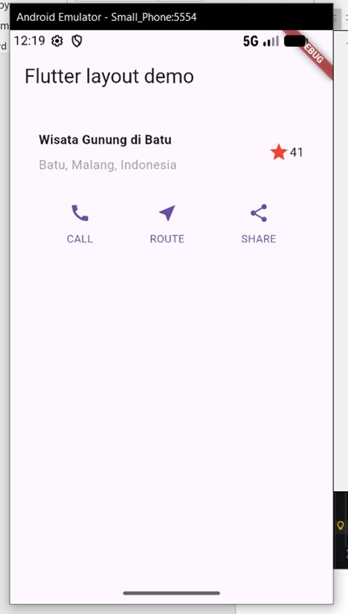
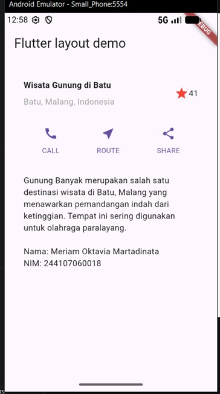
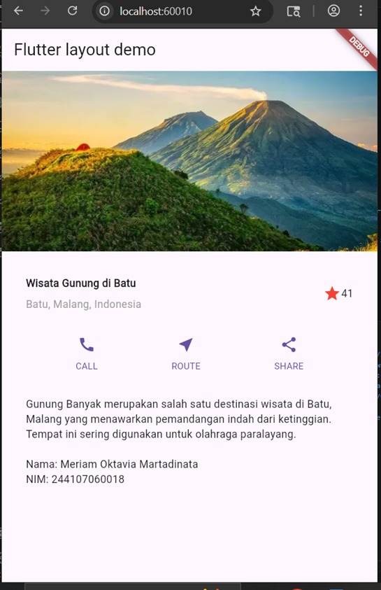
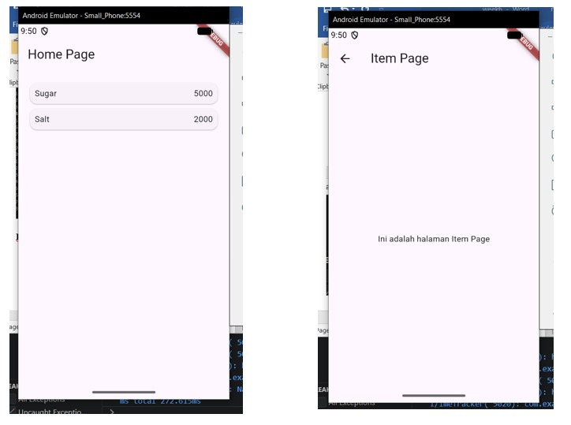
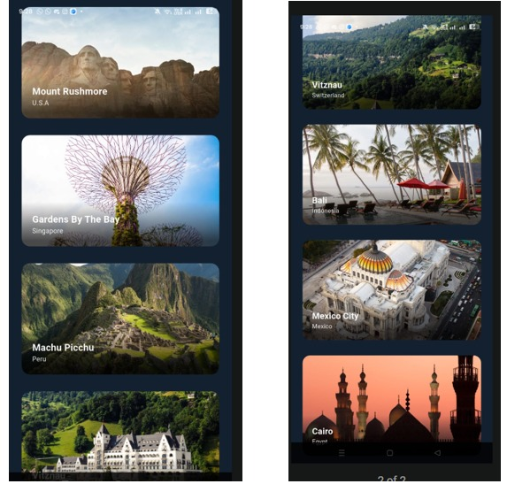
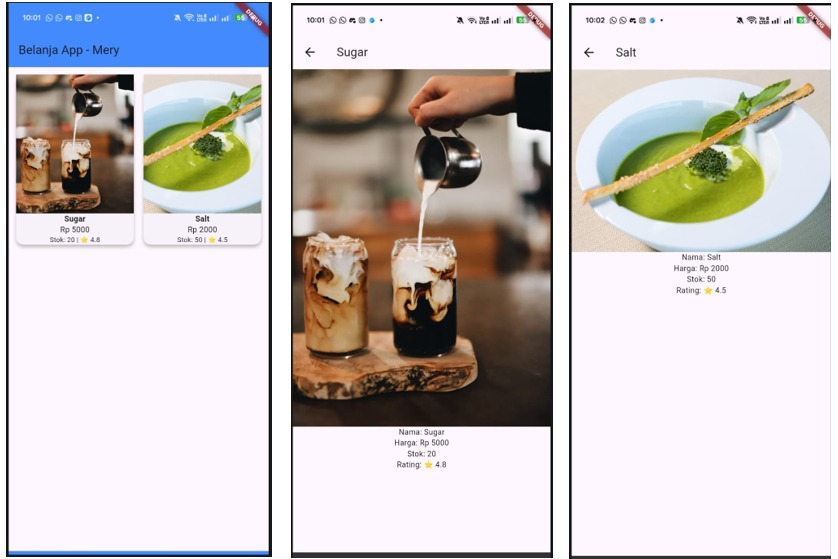
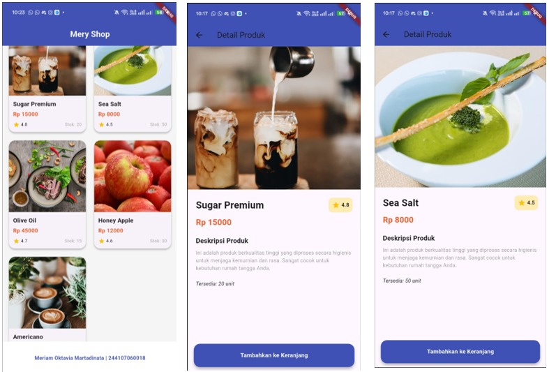

# 📱 Laporan Praktikum Flutter Layout & Navigasi

* **Nama:** Meriam Oktavia Martadinata
* **NIM:** 244107060018
* **Kelas:** SIB-2G

---

## Praktikum 1: Menjalankan Aplikasi Flutter Baru

> **Deskripsi:** > Implementasi bagian header menggunakan susunan widget `Row` dan `Column` untuk menampilkan teks judul utama, sub-judul lokasi, dan ikon *rating* bintang.

---

## Praktikum 2: Implementasi Button Row

> **Deskripsi:** > Penambahan baris aksi interaktif (Call, Route, Share). Disusun menggunakan widget `Row` dengan properti `spaceEvenly` agar jarak antar elemen tombol simetris dan rapi.

---

## Praktikum 3: Implementasi Text Section

> **Deskripsi:** > Menampilkan paragraf deskripsi tempat wisata beserta identitas pengembang (*author*). Menggunakan widget `Text` yang dibungkus dengan `Padding` agar tulisan memiliki margin yang nyaman dibaca.

---

## Praktikum 4: Implementasi Image Section

> **Deskripsi:** > Tampilan akhir aplikasi setelah penambahan *hero image* (gambar utama) di bagian paling atas. Layout ini sudah terintegrasi secara utuh dan bersifat *cross-platform* (dapat berjalan lancar baik di emulator Android maupun Web Browser).

---

## Praktikum 5: Membangun Navigasi di Flutter

> **Deskripsi:** > Demonstrasi implementasi perpindahan halaman (*routing*) pada Flutter.
> * **Layar Kiri (Home Page):** Menampilkan halaman utama yang berisi daftar item (seperti *Sugar* dan *Salt*) beserta harganya.
> * **Layar Kanan (Item Page):** Menampilkan halaman detail yang terbuka saat salah satu item pada *Home Page* ditekan. Halaman ini secara otomatis menyediakan tombol *back* (panah kembali) pada *AppBar* untuk mengembalikan pengguna ke halaman sebelumnya.

# Tugas Praktikum 1
> **Deskripsi:** > Implemetasi basic layout flutter di codelabs

# Tugas Praktikum 2
> **Deskripsi:** > Implementasi pengiriman data antarhalaman menggunakan Navigator Arguments serta penangkapannya melalui ModalRoute. Selain itu,mewajibkan pengembangan model data dengan atribut baru (foto, stok, rating), transformasi layout dari ListView menjadi GridView ala marketplace, penerapan Hero Animation untuk transisi visual yang halus, serta praktik clean code melalui pemecahan widget

**Fitur Utama:**
* **Navigator Arguments:** Pengiriman objek data utuh antarhalaman.
* **Model Data:** Penambahan atribut foto produk, stok, dan rating.
* **Layout Modern:** Transformasi dari `ListView` menjadi `GridView` (2 kolom).
* **Hero Animation:** Transisi gambar yang halus saat berpindah halaman.
* **Clean Code:** Pemecahan widget menjadi komponen yang lebih kecil (Refactoring).

**Analisis Output:**
Pada halaman utama (**Home Page**), data ditampilkan menggunakan widget `GridView` yang membagi layar menjadi dua kolom, memberikan tata letak kartu produk yang rapi dan interaktif. Setiap kartu produk memuat atribut lengkap: gambar produk (URL), nama, harga dengan aksen oranye, serta informasi stok dan rating bintang di bagian bawah. *Footer* aplikasi juga menampilkan identitas Nama dan NIM secara statis.

Ketika pengguna memilih salah satu produk, aplikasi menjalankan fungsi navigasi `Navigator.pushNamed` dengan menyertakan objek data sebagai *arguments*. Pada halaman detail (**Item Page**), data tersebut berhasil ditangkap menggunakan `ModalRoute` untuk menampilkan informasi spesifik produk. Implementasi **Hero Widget** memberikan efek transisi gambar yang halus dan sinkron saat berpindah antar halaman. Penggunaan `SafeArea` memastikan tombol aksi tidak tertutup oleh sistem navigasi perangkat.

---
*(Dokumentasi kode lengkap tersedia di folder `docs` dan repositori ini)*

